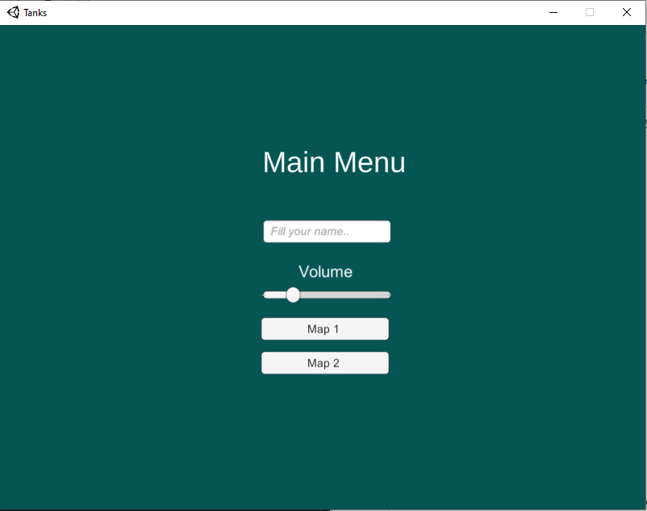
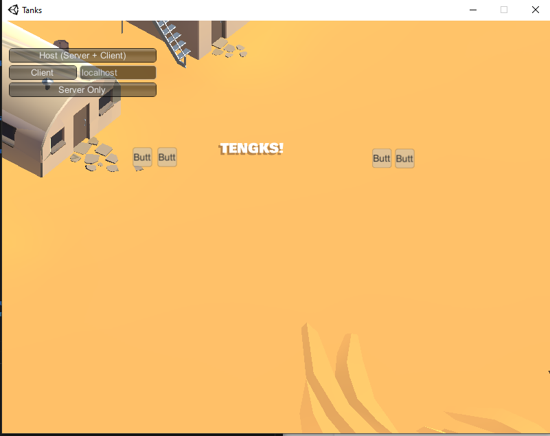
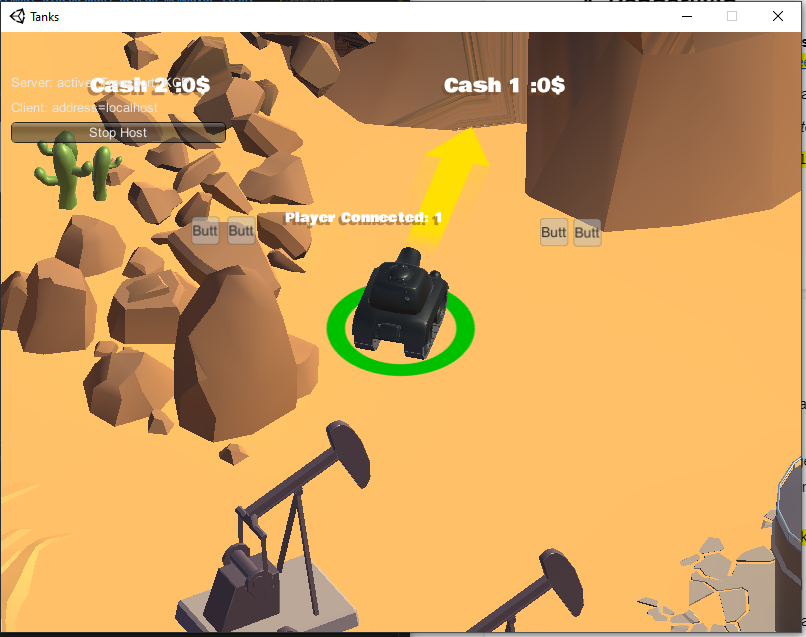
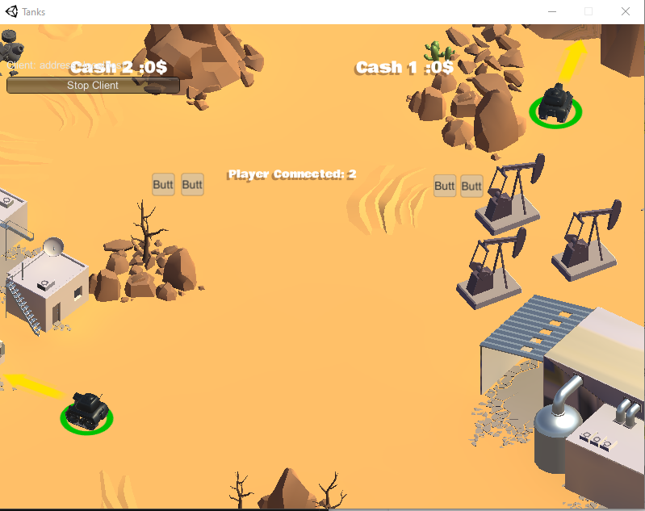

# IF3210-2021-Unity-K2-1

## Deskripsi Tugas

Pada tugas besar kali ini kami diminta untuk mengimplementasikan untuk mengembangkan sebuah game 3D top down dengan game playe tank battle royale. Permainan ini adalah ekstensi dari Tanks-Unity Learn dalam artian kami wajib membuat keseluruhan fitur yang ada pada tutorial dan menambahkan fitur-fitur tambahan wajib dengan spesifikasi sebagai berikut.
1.  Multiplayer dapat dijalankan secara local area network dengan lebih dari dua pemain. Implementasi matchmaking dibebaskan.
2.  Pada main menu, terdapat settings untuk mengatur intensitas suara dan nama pemain yang diimplementasikan dengan PlayerPrefs
3.  Desain pada map harus berbeda dari desain semula pada tutorial namun dapat menggunakan aset apapun.
4.  Terdapat objek cash yang muncul secara periodik. Tank dapat mengambil cash untuk menambahkan uang yang dimilikinya.
5.  Terdapat minimal dua jenis senjata dengan karakteristik yang berbeda. Pemain dapat membeli senjata dengan menggunakan cash.
6.  Terdapat minimal dua jenis karakter bergerak yang dapat dikeluarkan (tempat dibebaskan) dengan membayar cash, memiliki behavior yang berbeda, dan dapat diserang dengan peluru. Sebagai referensi, karakter dapat berupa infantry yang berjalan mengikuti pergerakan musuh dan menembak secara periodik.
7.  Animasi saat karakter bergerak melakukan aksi (contohnya jalan, tembak, dan diam) harus berbeda, namun dapat menggunakan aset apapun.
8. Terdapat interaksi collision antara objek bergerak seperti tank dan karakter.
9.  Aset tambahan yang digunakan dibebaskan namun perlu dituliskan pada credits.

Adapun fitur tambahan yang tidak wajib kami implementasikan yaitu:
1.  Terdapat lebih dari satu map yang dapat dipilih oleh pemain.
2.  Terdapat lebih dari satu game mode selain battle royale. Sebagai referensi, contoh game mode lain adalah racing atau timed money race.
3.  Melakukan pembuatan (initiate) dan penghancuran (destroy) dari peluru, cash, dan karakter bergerak merupakan hal yang boros. Maka dari itu, lakukanlah optimisasi terkait hal ini dalam aplikasi dengan menggunakan Object Pooling.

## Cara Kerja

### Multiplayer dapat dijalankan secara local area network dengan lebih dari dua pemain. Implementasi matchmaking dibebaskan.
1.  Run aplikasi game
2. Pilih mau menjadi host atau client
3. Jika menjadi client maka menunggu host, jika menjadi host+client maka dapat mengatur setting game

### Pada main menu, terdapat settings untuk mengatur intensitas suara dan nama pemain yang diimplementasikan dengan PlayerPrefs
1. isi nama di field nama
2. setting suara sesuai keinginan secara default suara akan diset setengah volume penuh

### Desain pada map harus berbeda dari desain semula pada tutorial namun dapat menggunakan aset apapun.
1. pilih map yang disediakan dimain menu
2. menunggu kemudian join sebagai host atau client

### Terdapat objek cash yang muncul secara periodik. Tank dapat mengambil cash untuk menambahkan uang yang dimilikinya.
1.  mainkan permainan
2.  kemudian tunggu samapi cas muncul dimap
3.  tabrak cash tersebut untuk mendapatkan cash

### Terdapat minimal dua jenis senjata dengan karakteristik yang berbeda. Pemain dapat membeli senjata dengan menggunakan cash.
1.  Kumpulkan uang sebanyak banyak untuk mencapai minimum uang membeli senjata
2.  Kemudian beli senjata satu untuk mengaktifkan pemebelian senjata dua

### Terdapat minimal dua jenis karakter bergerak yang dapat dikeluarkan (tempat dibebaskan) dengan membayar cash, memiliki behavior yang berbeda, dan dapat diserang dengan peluru. Sebagai referensi, karakter dapat berupa infantry yang berjalan mengikuti pergerakan musuh dan menembak secara periodik.
1. objek-objek ini akan muncul bebas di map
2. kemudian player dapat menembak objek ini

### Animasi saat karakter bergerak melakukan aksi (contohnya jalan, tembak, dan diam) harus berbeda, namun dapat menggunakan aset apapun.
1.  Terdaat debu ketika tank berjalan
2.  arah panah untuk menunjukan arah senjata tank

### Terdapat interaksi collision antara objek bergerak seperti tank dan karakter.
1.  tank akan terpantul jika menabrak objek lain

### Aset tambahan yang digunakan dibebaskan namun perlu dituliskan pada credits.
1.  Goldcoin
2.  Bombakud
3.  Cow
4.  Rock01
5.  Rock02
6.  Rock03
7.  Building01
8.  Building02

### Aset tambahan fitur
####  Terdapat lebih dari satu map yang dapat dipilih oleh pemain.
1. Pergi ke main menu
2. pilih map yang ada di menu
#### Melakukan pembuatan (initiate) dan penghancuran (destroy) dari peluru, cash, dan karakter bergerak merupakan hal yang boros. Maka dari itu, lakukanlah optimisasi terkait hal ini dalam aplikasi dengan menggunakan Object Pooling.

## Library tambahan
1. Mirror
Mirror merupakan library yang kami gunakan untuk untuk menangani multiplayer menggunakan LAN

## Screeshoot aplikasi
1. Main Menu

2. Pilih Client/Host

3. View 1 Player

4. View 2 Player

## Pembagaian Tugas
### Arung Agamai Budi Putera 13518005
1. Multiplayer
2.  Animasi saat karakter bergerak melakukan aksi (contohnya jalan, tembak, dan diam) harus berbeda, namun dapat menggunakan aset apapun.
3. Terdapat interaksi collision antara objek bergerak seperti tank dan karakter.
4.  Aset tambahan yang digunakan dibebaskan namun perlu dituliskan pada credits.
### Fatkhan Masruri 13518063
1. Dokumentasi tugas (Readme)
### Cynthia Athena 13518059
1. Terdapat lebih dari satu map yang dapat dipilih oleh pemain.
2. Pada main menu, terdapat settings untuk mengatur intensitas suara dan nama pemain yang diimplementasikan dengan PlayerPref
3. Desain pada map harus berbeda dari desain semula pada tutorial namun dapat menggunakan aset apapun.
### Arya Beri Argya Rasidi 13518131
1. Terdapat objek cash yang muncul secara periodik. Tank dapat mengambil cash untuk menambahkan uang yang dimilikinya.
2.  Terdapat minimal dua jenis senjata dengan karakteristik yang berbeda. Pemain dapat membeli senjata dengan menggunakan cash.